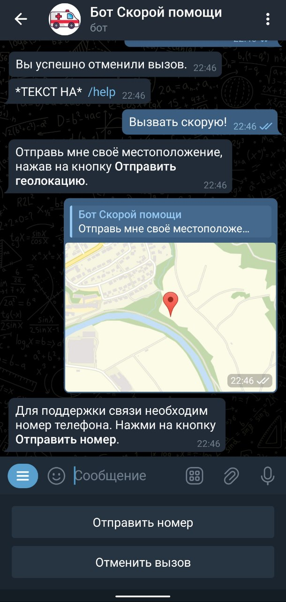
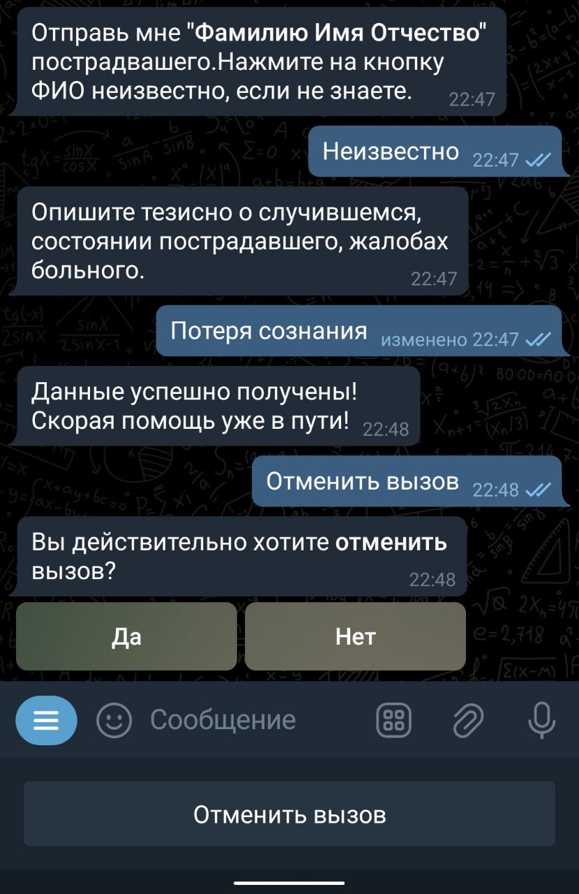
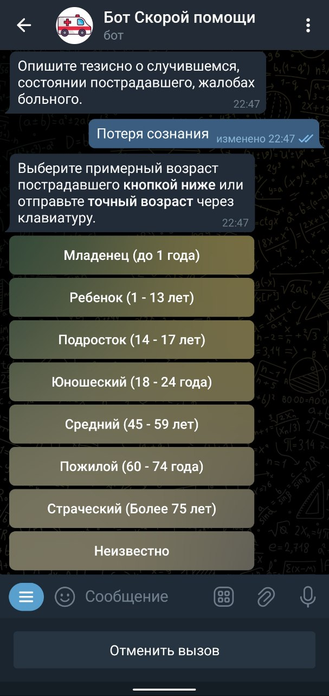
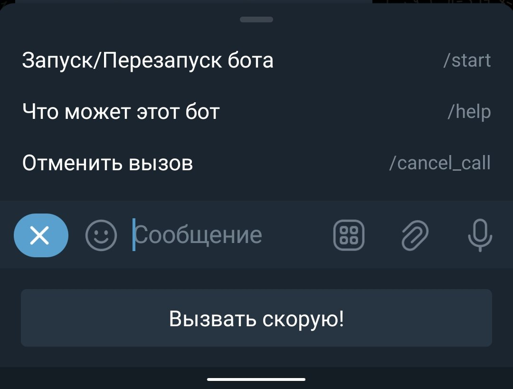

# AmbulanceBot 🤖

Telegram-бот для вызова скорой помощи и экстренных служб.

## 📋 Обзор проекта

[AmbulanceBot](https://t.me/dev_ambulance_bot) - это Telegram-бот, разработанный для упрощения процесса вызова скорой помощи и экстренных служб. Бот предоставляет удобный интерфейс для быстрого вызова помощи и передачи необходимой информации диспетчерам.

### Основной функционал
- Вызов скорой помощи через Telegram
- Сбор и передача важной информации о пациенте
- Интеграция с системой экстренных служб
- Удобный пользовательский интерфейс с кнопками

### Используемые технологии
- Python 3.x
- aiogram 3.0.0b7
- aiohttp
- environs для конфигурации
- FSM (Finite State Machine) для управления состояниями

## 🚀 Установка и настройка

### Требования
- Python 3.8 или выше
- Токен Telegram-бота (получить у [@BotFather](https://t.me/BotFather))

### Инструкция по установке

1. Клонируйте репозиторий:
```bash
git clone https://github.com/trxxnk/AmbulanceBot.git
cd AmbulanceBot
```

2. Создайте виртуальное окружение и активируйте его:
```bash
python -m venv venv
source venv/bin/activate  # для Linux/Mac
venv\Scripts\activate     # для Windows
```

3. Установите зависимости:
```bash
pip install -r requirements.txt
```

4. Создайте файл `.env` на основе `.example.env`:
```bash
cp .example.env .env
```

5. Отредактируйте `.env` файл, добавив ваш токен бота:
```
BOT_TOKEN=<ваш_токен_бота>
BOT_ID=<id_вашего_бота>
```

## 🏃‍♂️ Запуск бота

Для запуска бота выполните:
```bash
python main.py
```

## 💻 Использование бота

### Основные команды
- `/start` - Начало работы с ботом
- `/help` - Получение справки
- `/call` - Вызов скорой помощи

### Процесс вызова скорой помощи
1. Нажмите кнопку "Вызвать скорую помощь"
2. Следуйте инструкциям бота для предоставления необходимой информации
3. Подтвердите вызов
4. Дождитесь подтверждения от диспетчера

## 🖥 Интерфейс бота

### Главное меню
При запуске бота пользователь видит приветственное сообщение с основными кнопками:
- "Вызвать скорую помощь" - начало процесса вызова
- "Информация" - справочные материалы
- "Настройки" - настройки бота

<table>
<tr>
<td width="25%"></td>
<td width="25%"></td>
<td width="25%"></td>
<td width="25%"></td>
</tr>
<tr>
<td align="center"><b>Получение геолокации</b></td>
<td align="center"><b>Отмена вызова</b></td>
<td align="center"><b>Указание возраста</b></td>
<td align="center"><b>Команды (меню) бота</b></td>
</tr>
</table>

### Процесс вызова скорой помощи
1. **Начальный экран**
   - Кнопка "Вызвать скорую помощь"
   - Информация о доступных службах

2. **Форма сбора данных**
   - Поля для ввода адреса
   - Выбор типа экстренной ситуации
   - Описание симптомов
   - Контактная информация

3. **Подтверждение вызова**
   - Сводка введенной информации
   - Кнопки "Подтвердить" и "Отменить"
   - Инструкции по ожиданию помощи

### Информационный раздел
- Справочные материалы по первой помощи
- Контакты экстренных служб
- Часто задаваемые вопросы

### Настройки
- Язык интерфейса
- Уведомления
- Сохраненные адреса

## 🏗 Архитектура проекта

### Структура проекта
```
AmbulanceBot/
├── config_data/     # Конфигурационные файлы
├── FSM/            # Конечные автоматы состояний
├── handlers/       # Обработчики команд и сообщений
├── keyboards/      # Клавиатуры и кнопки
├── lexicon/        # Текстовые сообщения
├── main.py         # Точка входа
├── requirements.txt # Зависимости
└── .env           # Конфигурация окружения
```

### Ключевые компоненты
- `main.py` - Основной файл запуска бота
- `handlers/` - Обработчики команд и сообщений
- `FSM/` - Управление состояниями диалога
- `lexicon/` - Текстовые сообщения и меню

## 👨‍💻 Разработка

### Настройка среды разработки
1. Установите все зависимости из `requirements.txt`
2. Настройте линтер (autopep8)
3. Создайте отдельную ветку для разработки

### Правила оформления кода
- Следуйте PEP 8
- Используйте типизацию
- Документируйте функции и классы

## 🔒 Безопасность

- Токены и конфиденциальные данные хранятся в `.env` файле

## ❓ FAQ

### Частые проблемы
1. **Бот не отвечает**
   - Проверьте подключение к интернету
   - Убедитесь, что токен бота верный

2. **Ошибка при запуске**
   - Проверьте наличие всех зависимостей
   - Убедитесь, что файл `.env` создан и заполнен

## 📞 Контакты

- GitHub Issues: [Создать issue](https://github.com/trxxnk/AmbulanceBot/issues)
- Автор: [@trxxnk](https://github.com/trxxnk)
